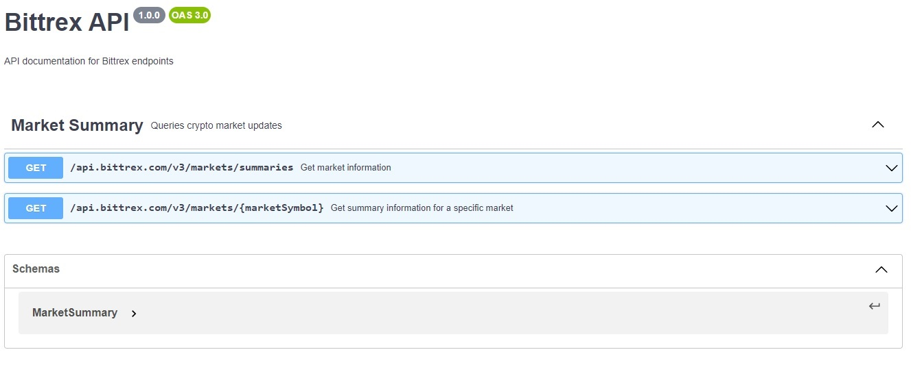

# crypto_update_app

A simple micro service application to fetch crypto currency market update from bittrex site

## How to execute the APIs in the browser

Run the following APIs to verify that the application is successfully running as docker container

1. http://localhost:5000/api.bittrex.com/v3/markets/summaries
2. http://localhost:5000/api.bittrex.com/v3/markets/ARB-USDT


## How to run the Linting and Code coverage tool using tox

Execute the tox command to run the test execution environments

```bash
(env) PS F:\application> tox
flake8: commands[0]> flake8 bittrex_app_src
flake8: OK ✔ in 5.26 seconds
coverage: commands[0]> pytest --cov=bittrex_app_src
=============================================== test session starts ================================================
platform win32 -- Python 3.8.1, pytest-7.4.0, pluggy-1.2.0
cachedir: .tox\coverage\.pytest_cache
rootdir: F:\application
plugins: cov-4.1.0
collected 6 items

bittrex_app_src\test_run.py ......                                                                            [100%] 

----------- coverage: platform win32, python 3.8.1-final-0 -----------
Name                              Stmts   Miss  Cover
-----------------------------------------------------
bittrex_app_src\__init__.py           0      0   100%
bittrex_app_src\app.py               22     10    55%
bittrex_app_src\config_parse.py      12      2    83%
bittrex_app_src\summary.py           27      0   100%
bittrex_app_src\test_run.py          61      0   100%
-----------------------------------------------------
TOTAL                               122     12    90%


================================================ 6 passed in 3.74s ================================================= 
  flake8: OK (5.26=setup[1.50]+cmd[3.77] seconds)
  coverage: OK (8.61=setup[0.17]+cmd[8.44] seconds)
  congratulations :) (16.55 seconds)
```

## Visual representation of API documentation

